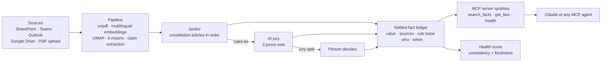

# Spotless: not one conflicting fact left

Spotless is the Pack Overflow team's answer to the SD Worx challenge "How might we turn fragmented organisational knowledge into a trusted shared resource?". A janitor agent reads every document you connect, settles conflicting facts by a constitution you control, and asks a person only when it cannot decide. Claude and other agents read the settled facts through an MCP server.

## The problem

SD Worx (10k colleagues, 100k customers, 6M payslips a month, 100+ payroll engines in 30 countries) described it on stage: a consultant with an urgent client question asks the existing AI assistant and gets three documents, one without an owner, one edited last week, one with the right title but for another country. A colleague then emails a fourth. Which one do you trust? Their explicit no-go: "We don't want a SharePoint with a search function. We don't want another AI agent either."

Spotless therefore does not add a new place to ask. It cleans the knowledge base itself, so the assistants people already use (Claude, ChatGPT or any MCP client) answer from settled facts only.

## Architecture



| Step | Code |
|---|---|
| Parse, embed, cluster, extract claims from real PDFs | [`pipeline/run.ts`](pipeline/run.ts), [`pipeline/cluster.ts`](pipeline/cluster.ts), [`src/lib/embed.ts`](src/lib/embed.ts) |
| Settle conflicts by constitution, jury, then person | [`src/lib/janitor.ts`](src/lib/janitor.ts) (`runJanitor`, `DEFAULT_RULES`) |
| Health, consistency, freshness, certainty maths | [`src/lib/health.ts`](src/lib/health.ts) |
| Shared data contract | [`src/lib/types.ts`](src/lib/types.ts) |
| Ledger API read by the MCP server | [`src/app/api/ledger/route.ts`](src/app/api/ledger/route.ts) |
| MCP server | [`mcp/server.ts`](mcp/server.ts) |
| Grounded answers with per-fact citations | [`src/app/api/ask/route.ts`](src/app/api/ask/route.ts), [`src/lib/llm.ts`](src/lib/llm.ts) |

## Results on the demo corpus

Measured with `npm run check` ([`scripts/check-engine.ts`](scripts/check-engine.ts)) and `pipeline/run.ts` ([`src/data/pipeline-report.json`](src/data/pipeline-report.json)):

- 100 documents in Dutch, French and English stating 61 claims about 25 facts; 19 of those facts are in conflict.
- The constitution settles 13 conflicts, the jury 3 (3-0 votes), and 3 go to a person (2-1 split jury).
- Data health goes 40 → 71 after the rules, → 90 after archiving stale and duplicate documents, → 100 after the three human decisions.
- The janitor runs over the whole corpus in 0.18 ms, so every rule change in Setup re-judges everything live.
- The PDF pipeline parsed 150 pages, clustered them with 87% purity and re-found 48 of the 61 planted claims with Claude Haiku.

## How it maps to the judging criteria

**Originality.** It is not a search box and not another chatbot, the two things the brief ruled out. The unit of work is the fact, not the document: a janitor settles each conflicting fact once, with a constitution the business owns (ordered, switchable articles such as scope match, source authority and effective date), escalates ties to a three-juror AI jury, and only a split jury reaches a person. Every verdict carries its full rule trace, so "why is this right" is always one click away. Knowledge quality becomes a number, the health score, that a team can own.

**Technical ability.** A deterministic rules engine with a per-rule trace ([`src/lib/janitor.ts`](src/lib/janitor.ts)), a real ingestion pipeline over 100 generated PDFs with local multilingual embeddings, UMAP and k-means ([`pipeline/run.ts`](pipeline/run.ts)), a stdio MCP server built on `@modelcontextprotocol/sdk` ([`mcp/server.ts`](mcp/server.ts)), and an LLM layer with timeouts, a concurrency cap of 4 and a provider fallback ([`src/lib/llm.ts`](src/lib/llm.ts)). Answers only cite fact ids that exist in the ledger; anything else is dropped ([`src/app/api/ask/route.ts`](src/app/api/ask/route.ts)).

**Applicability.** The demo corpus replays the brief's four-documents moment on real Belgian payroll topics: the 2026 indexation cap above €4,000 (a Netherlands policy is dropped by the scope article, the "right title, wrong country" case), meal vouchers, eco-cheques for part-timers, PC 200 year-end bonus, flexi-jobs, the 2026 reintegration rules. The expert question is answered by provenance: every settled fact names who wrote, owns and vouched for it, which also covers the client-handover pain. It plugs into tools SD Worx already runs rather than replacing them.

**Security.** See [`SECURITY.md`](SECURITY.md): synthetic data only, no API keys in the app, sandboxed LLM calls, read-only Google Drive scope, secrets kept out of git.

## What is real and what is simulated

| Real, running code | Simulated for the demo |
|---|---|
| Janitor rules engine, rule trace, health maths | The 100 documents: synthetic PDFs from [`scripts/seed.ts`](scripts/seed.ts) with 61 planted claims |
| PDF parsing, local multilingual embeddings, UMAP, k-means, Haiku claim extraction | Jury transcripts: advocate and juror turns are seeded; the tally, the 0.75 threshold and routing to a person are computed live |
| Semantic search across NL/FR/EN (`/api/embed`) | SharePoint, Teams, Outlook, OneDrive, Confluence and mysdworx connectors (UI only, they feed the seeded corpus) |
| Agent answers via Claude Haiku with validated citations | Payroll data used by the "payroll data agreement" article (`payrollFacts` in the corpus) |
| MCP server and ledger API | One hardcoded user (Lotte Peeters, knowledge lead Payroll BE), no auth |
| Google Drive connector with real Google sign-in, read-only scope | |

## Views

The left sidebar shows the live data health score and switches between four views.

- **Janitor** (home): the janitor cleans every connected file that it has not processed yet, one by one, without a start button. The page shows the health score and its history, the queue with the outcome per file, how often each constitution article fired, and the conflicts. Opening a conflict shows both sources side by side with the AI jury's suggestion; accepting it or picking a value settles the fact. The sidebar badge counts the conflicts that need a person.
- **Search**: semantic search over the connected documents with multilingual embeddings (`/api/embed`), so a Dutch query finds French and English documents. Each hit shows whether its facts are settled, superseded or in conflict.
- **Agent**: Claude connected to the `spotless` MCP server, answering in Dutch, French or English from settled facts only, with a citation per fact.
- **Setup**: the connectors (SharePoint, Teams, Outlook, OneDrive, Confluence, mysdworx Documents, PDF upload) and the constitution.

## Health model

Health covers the connected documents only and is the mean of two parts.

- Consistency: the share of facts without an open conflict. A conflict is open until the janitor has processed all its documents, and stays open while it needs a person.
- Freshness: the share of connected documents that are current. Stale, superseded and duplicate documents count against it until the janitor archives or flags them.

Certainty is the average confidence of the settled facts: 1.0 when all sources agree or a person decided, 0.9 when a rule decided, 0.8 when the AI jury decided. Confirming a janitor decision raises that fact to 1.0.

## Constitution

The constitution is an ordered list of articles the janitor applies when sources disagree: scope match, source authority, effective date, payroll data agreement, owner present and author seniority. Users reorder them and switch them on or off in Setup. Ties go to a three-juror AI jury, and a split jury goes to a person. The engine is `src/lib/janitor.ts`.

## MCP server

`mcp/server.ts` exposes `search_facts`, `get_fact` and `health`. It reads the ledger from the running app (`/api/ledger`) and falls back to `.cache/ledger.json`. Register it with Claude Code:

```bash
claude mcp add spotless -- npx tsx /absolute/path/to/packoverflow/mcp/server.ts
```

## Run

```bash
npm install
npm run dev          # http://localhost:3100 (the origin registered for Google Drive sign-in)
npm run check        # prints every verdict with its rule trace, the health stages and engine timing
npm run build
```

Copy `.env.example` to `.env.local` only if you want the Google Drive connector; everything else runs without configuration.

URL shortcuts: `?reset` clears state, `?demo` connects every demo source with all files queued, `?clean` connects everything already cleaned, and `?step=<janitor|search|agent|setup>` opens a view.

The Agent view and the pipeline call the local Claude Code CLI (`claude -p --model haiku`), falling back to `codex exec`. The app stores no API key.

## Data and pipeline

- `scripts/seed.ts` generates the synthetic corpus (`src/data/corpus.json`) and 100 real PDFs (`public/pdfs`). All names, clients and values are fictional.
- `pipeline/run.ts` reads the PDFs with unpdf, embeds them with `Xenova/paraphrase-multilingual-MiniLM-L12-v2`, projects them with UMAP, clusters them with k-means and asks Haiku to re-extract the claims. Last run: 100 PDFs, 150 pages, cluster purity 87%, 48 of 61 planted claims re-found.
